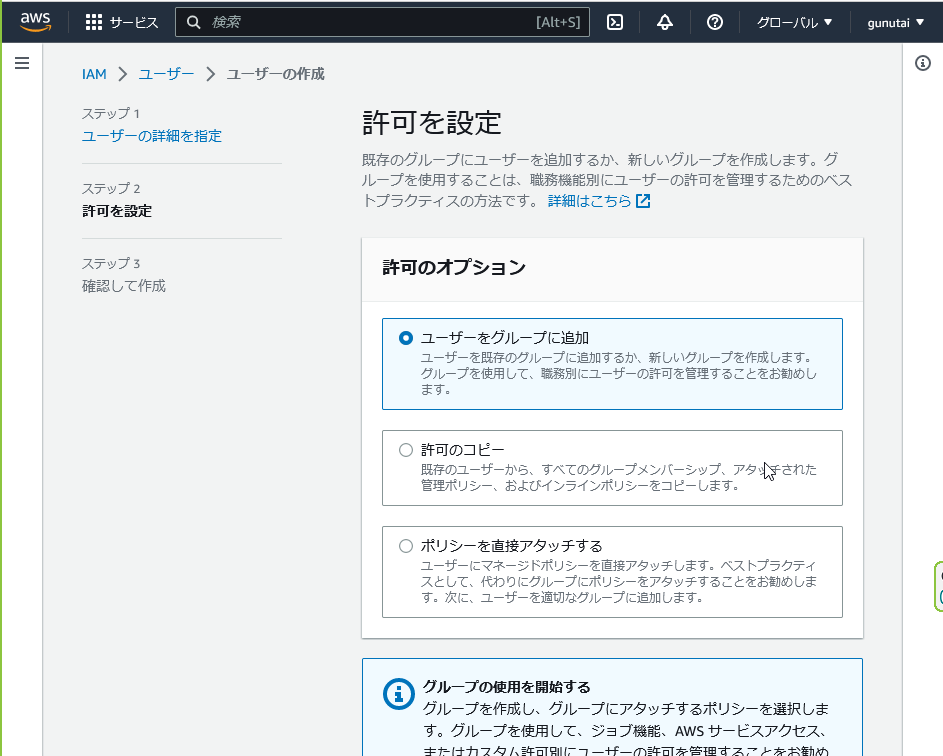
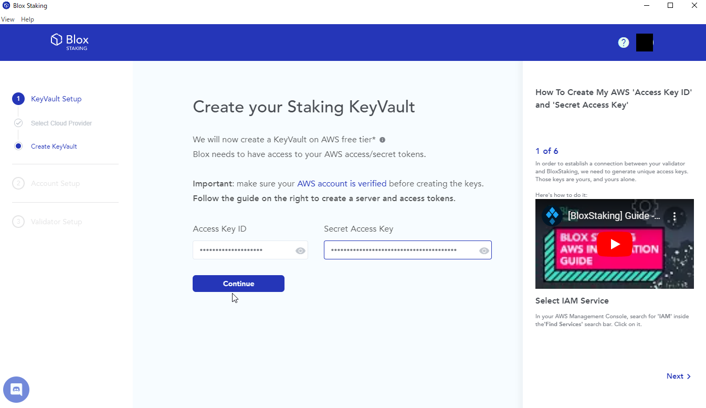

# BloxStakingでステーキングしてEigenlayerにリステーキング

## 概要
Eigenlayerは、ステーキング済みのETHを更にロック（リステーキング）することによって利回りを得ることが出来るプロトコルです。このマニュアルでは、バリデータのセットアップからEigenlayerでのリステーキングの設定を説明します。
*※マニュアル作成の都合上、メインネットではなく、Goerli(Prater)テストネット上での動作を行っていますが、仕様上変更はありません。*

## 目次
- [BloxStakingでステーキングしてEigenlayerにリステーキング](#bloxstakingでステーキングしてeigenlayerにリステーキング)
  - [概要](#概要)
  - [目次](#目次)
  - [BloxStakingの紹介](#bloxstakingの紹介)
  - [Eigenlayerでの設定](#eigenlayerでの設定)
  - [AWSでのアカウント開設からリモート署名の設定](#awsでのアカウント開設からリモート署名の設定)
    - [AWSでのアカウント開設（もう持ってる人はスキップしてOK）](#awsでのアカウント開設もう持ってる人はスキップしてok)
    - [AWSでのリモート署名の設定](#awsでのリモート署名の設定)
      - [リモート署名用のユーザー作成](#リモート署名用のユーザー作成)
      - [アクセスキー、シークレットアクセスキーの設定](#アクセスキーシークレットアクセスキーの設定)
  - [BloxStaking/Wagyu Key Generator側の設定](#bloxstakingwagyu-key-generator側の設定)
    - [必要なソフトウェアのインストール](#必要なソフトウェアのインストール)
    - [BloxStakingのアカウント登録](#bloxstakingのアカウント登録)
    - [BloxStakingでの初期設定](#bloxstakingでの初期設定)
    - [WagyuKeyGeneratorでのバリデータのアカウント設定](#wagyukeygeneratorでのバリデータのアカウント設定)
    - [BloxStakingへのバリデータの追加・デポジット](#bloxstakingへのバリデータの追加デポジット)
  - [BloxStakingの移行](#bloxstakingの移行)
    - [バリデータサービスの選定](#バリデータサービスの選定)
    - [バリデータの移行](#バリデータの移行)
  - [バリデータの停止・終了](#バリデータの停止終了)
  - [バリデータの状況確認](#バリデータの状況確認)

## BloxStakingの紹介
BloxStakingは、Ethereumのバリデータを運用するサービスを展開しています。また、このバリデータはMEVを効率的に活用するクライアントとしてカスタムされており、比較的、他サービスに比べて年間の利率が高くなっています。


BloxStakingでは、ノンカストディかつバリデータの署名鍵（ブロックに対して署名する際の秘密鍵のこと）を自サービスで保管しません。
そのため、BloxStakingから他のサービスへの移行や、自分のノードへの移行がしやすくなっています。

このメリットは、自分の署名鍵の保有権はあくまで自分にある（という形）ということです。
このデメリットは、リモート署名に対応した署名鍵保管サービスを利用しなければならないことです。BloxStakingでは、AWSを使用してリモート署名を行うので、BloxStakingのアカウントだけではなく、AWSのアカウントも必要になります。

この際、リモート署名用のIAMユーザーを設定する必要があります。EC2のフルアクセス権を設定するため、必要であれば、新規にアカウントを取得してください。

## Eigenlayerでの設定
Eigenlayerでは、バリデータの引き出し先及び手数料の送信先をEigenlayerのコントラクト=*Eigenpod*（このコントラクトは個人ごとに生成されます）に設定することで、バリデータの制御を行います。Eigenpodの作成手順を紹介します（Eigenlayer側はこの作業だけしかありません。簡単ですね）。

1. https://app.eigenlayer.xyz/details?asset=ETH にアクセスしてください。
2. "Connect to Wallet"ボタンをクリックし、自身のウォレットに接続してください。
3. "Create EigenPod"ボタンをクリックし、トランザクションに署名してください。
4. トランザクションが承認されると、以下の画面が表示されます。EigenPod Addressの右側のコピー（アイコン）ボタンをクリックし、アドレスをメモ帳等に転記してください（画面は閉じないでください）。


   

## AWSでのアカウント開設からリモート署名の設定

### AWSでのアカウント開設（もう持ってる人はスキップしてOK）
AWSでのアカウント開設には、メールアドレスとクレジットカードが必要です。
1. https://portal.aws.amazon.com/billing/signup にアクセスし、アカウント開設ウィンドウを開きましょう。メールアドレス・AWSアカウント名（どちらも任意）を入力し、"認証コードをEメールアドレスに送信"ボタンをクリックします。


   

2. メールアドレスに認証コードが届いたら、確認コード欄に入力し、"認証を完了して次へ"ボタンをクリックします。


   

3. 以下スキップ・画面の指示に従ってください。

### AWSでのリモート署名の設定
#### リモート署名用のユーザー作成
BloxStakingで署名用の鍵をアップロードするために、AWSに特定の権限を持つユーザーを設定します。
1. ログインしたら、コンソールという画面になっています。左上AWSのロゴの右側にある、"サービス"メニューをクリックします。


   
2. サービスメニューが開いたら、下にスクロールして、"セキュリティ、IDおよびコンプライアンス"をクリックします。すると、右側にサービス一覧が表示されるので、"IAM AWSリソースへのアクセスの管理"をクリックします。


   
3. IAMダッシュボードが開いたら、ページ中段の"IAM リソース"内、"ユーザー"欄の**0**をクリックします。※赤四角箇所


   
4. ユーザー一覧が開いたら、"ユーザーを追加"ボタンをクリックします。


   
5. ユーザーの詳細が開いたら、ユーザー名として、任意の名前を入力し、"次へ"ボタンをクリックします。


   
6. 許可を設定が開いたら、許可のオプションとして"ポリシーを直接アタッチする"を選び、下へスクロールします。


   
7. 許可ポリシーの欄が広がっているので、検索バーに"EC2Full"と入力して、出てきたポリシー（"AmazonEC2FullAccess"）にチェックを入れます。


   
8. チェックを入れたら、下にスクロールして"次へ"ボタンをクリックします。


   
9.  確認して作成が開いたら、ユーザ名（ステップ5で設定）と許可の概要（ステップ7で設定）が間違っていないか確認し、"ユーザーの作成"ボタンをクリックします。


   
10. ユーザー一覧画面に戻り、上部に"ユーザーが正常に作成されました"と表示されています。また、ユーザー一覧画面では、先ほど設定したユーザーが表示されているはずです。


   

#### アクセスキー、シークレットアクセスキーの設定
1. ユーザー一覧画面で、自身が設定したユーザー名（ここではblox-staking-goerli-test01 ）をクリックします。


   
2. ユーザーの詳細を表示する画面が開いたら、"セキュリティ認証情報"をクリックします。※赤四角箇所


   
3. コンソールサインイン、多要素認証の設定画面が表示されたら、下へスクロールして"アクセスキーを作成"ボタンをクリックします。※赤四角箇所


   
4. アクセスキーを作成画面が表示されたら、ユースケースとして、"AWSの外部で実行されるアプリケーション"を選択します。


   
5. 説明タグを設定-オプション画面が表示されたら、自分がわかりやすいよう、適当に説明タグ値に入力します（ここでは、"blox-staking-goerli"）。その後、"アクセスキーを作成"ボタンをクリックします。


   
6. アクセスキーを取得画面が表示され、アクセスキー及びシークレットアクセスキーが表示されます。※シークレットアクセスキーは"表示"をクリックすると表示されます。


   
1. アクセスキー、シークレットアクセスキーをコピーして、メモ帳等に転記してください（BloxStakingの設定で貼り付けます）（画面は閉じないでください）。

## BloxStaking/Wagyu Key Generator側の設定
### 必要なソフトウェアのインストール
- BloxStaking: https://www.bloxstaking.com/download/
- WagyuKeyGenerator: https://wagyu.gg/
よりそれぞれ自身の使用するOSに合わせた種類のソフトウェアをインストールしてください。
BloxStakingは、Ethereumチェーン上でのステーキングのためのバリデータセットアップ、運用のためのソフトウェアです。
WagyuKeyGeneratorは、バリデータを設定する上で必要となるアカウントのキーを生成するためのソフトウェアです。

### BloxStakingのアカウント登録
インストールした、BloxStakingのソフトウェアを起動してください。すると、以下の画面のように、Google/Github/Microsoftアカウントでのアカウント開設を要求されますので、好きな方法でアカウントを開設してください。


   

### BloxStakingでの初期設定
BloxStakingでは、リモート署名を使用するため、KeyVault（署名鍵をAWS上にアップロードする機能）を利用する必要があります。

1. Start Your Staking Journeyという表示とともに、"KeyVault Setup"ボタンが表示されたら、クリックしてください。


   
2. Select your Cloud Providerという画面が表示されたら、awsのロゴがついている、"Amazon Web Server"ボタンをクリックします。


   
3. Create your Staking KeyVaultという画面が表示されたら、[アクセスキー、シークレットアクセスキーの設定](#アクセスキーシークレットアクセスキーの設定) のステップ7で転記した、アクセスー、シークレットアクセスキーをそれぞれ、"Access Key ID", "Secret Access Key"に転記してください。


   
4. 転記が完了したら、"Continue"ボタンをクリックします。
5. "Continue"ボタンの真下に、青いバーが表示されるので、100%になり、次の画面に変わるまで待ってください。※体感5分～10分くらい
6. 完了後、"KeyVault created successfully!"と画像のように表示されるので、"Set Account Password"ボタンをクリックしてください。


   
7. Account Passwordという画面が表示されたら、自身の好きなパスワードを入力、"Confirm"ボタンをクリックしてください（パスワードが漏洩しても資産が消失することはありませんが、バリデータの動作を停止されることはあり得ます）。


   
8. Seed Phrase or Keystore Fileという画面が表示されたら、"Keystore File"ボタンをクリックしてください。


   
9.  Select your Staking networkという画面が表示されたら、"Stake on Mainnet"ボタンをクリックしてください（Goerliテストネットで試す場合は、"Test on Prater"ボタンをクリックしてください）。


   
1.   Upload Keystore Fileという画面が表示されます（画面は閉じないでください）。


   

### WagyuKeyGeneratorでのバリデータのアカウント設定
Ethereumのバリデータを作成するには、バリデータ用の秘密鍵、署名鍵及びデポジット用のデータを生成する必要があります。WagyuKeyGenerator以外にも、Ethdoなど様々なアプリケーションがあります。

1. インストールした、WagyuKeyGenのソフトウェアを起動してください。
2. Welcome!という表示とともに、画像のような画面が表示されます。"CREATE NEW SECRET RECOVERY PHRASE" をクリックしてください。**※もしGoerliテストネットで試したい場合は、右上の"Select Network: MAINNET"をクリックし、"Goerli"を選択して"Ok"ボタンをクリックしてください。**


   
3. Create Secret Recovery Phrase という画面が表示されたら、"CREATE"ボタンをクリックしてください。**※この画面では、リカバリーフレーズも重要だし、この作業で生成するバリデータキーも非常に重要だから、大事に扱ってねということ及び、オフラインでやることを推奨と記載しています。リカバリーフレーズが流出した場合、勝手にバリデータを止められたり、意図的に不正な検証を行うことで、スラッシングを誘発することがあるだけでなく、ステーキングした32ETHを奪われることもあります（今回のガイドの方法で設定したバリデータについては、奪われることは基本的にありません）。**


   
4. 24個の英単語が表示されます。右のコピーボタン（アイコン）をクリックし、安全な場所に保存してください。保存したら、"NEXT"ボタンをクリックしてください。


   
5. 保存していることを再確認したら、"IM SURE"ボタンをクリックしてください。


   
6. 先ほどコピーした24個の英単語をペーストし、"CHECK"ボタンをクリックしてください。


   
7. Create Keysという画面が表示されたら、"Number of New Keys"に何個バリデータを作成したいか数字で入力し、"Password"に任意のパスワード（バリデータキーの暗号化パスワードになります。忘れるとバリデータを設定できなくなります）を、"Ethereum Withdrawal Address(Optional)"に[Eigenlayerでの設定](#eigenlayerでの設定) ステップ4で転記したEigenPodのアドレスを入力してください。その後、"NEXT"ボタンをクリックしてください。


   
8. パスワードの再入力画面が表示されたら、"Retype Password"に先ほど入力したパスワードを入力して、"NEXT"ボタンをクリックしてください。


   
9.  ファイルの保存先設定画面が表示されます。"BROWSE"ボタンをクリックして、ファイルをどこに保存するか選んでください。※作業完了時には、安全な場所に移してください。


   
10. ファイルの保存先を決めたら、"CREATE"ボタンをクリックしてください。
11. 作成に30秒程度時間がかかりますが、作成が完了すると、画像のような画面が表示されます。この画面では
    - keystore-xxx.jsonはトランザクションへの署名鍵（秘密情報）で、バリデータの設定に必要なこと
    - deposit_data-xxx.jsonはデポジット用データ（公開情報）なこと
    - リカバリーフェーズは上2つを再生成することができ、ステーキングする32ETHを引き出すために必要な情報となる（秘密情報）こと
    が表示されています。


   
12. "CLOSE"ボタンをクリックしてください（自動で画面が閉じます）。

### BloxStakingへのバリデータの追加・デポジット
今生成した、keystore-xxx.json/deposit_data-xxx.jsonを用いて、BloxStakingにバリデータの情報を追加し、32ETHのデポジットを行います。

1. [BloxStakingでの初期設定](#bloxstakingでの初期設定) ステップ10で表示されている、Upload Keystore Fileの画面に戻ります。"Drag & Drop"ボタンをクリックし、keystore-xxx.jsonを選択してください（ドラッグアンドドロップでもOK）。
2. 正しく選択した場合、"Uploaded Files"に選択したkeystore-xxx.jsonのファイル名が表示されます。"Keystore Password"に、[WagyuKeyGeneratorでのバリデータのアカウント設定](#wagyukeygeneratorでのバリデータのアカウント設定) ステップ7で入力したパスワードを入力してください。その後、"Next"ボタンをクリックしてください。


   
3. Validators Summaryという画面が表示されたら、"I agree to Blox's Privacy Policy and License and Service Agreement"及び"I confirm that I haven't deposited any of my validators above"にチェックを入れてください。ここでは、中断にバリデータのアドレスが表示されています。※プライバシーポリシーとサービス合意は一度確認してください。


   
4. チェック後、灰色から青色に変わった"Run Validator with BloxStaking"ボタンをクリックしてください。
5. Fee Recipient Addressという画面が表示されたら、中央の表（ステップ3でのバリデータアドレスが表示されている部分の右）のFee Recipient Addressに、[Eigenlayerでの設定](#eigenlayerでの設定) ステップ4で転記したEigenPodのアドレスを入力してください。


   
6. "I confirm that I have access to the addresses above"にチェックを入れ、"Next"ボタンをクリックしてください。
7. Mainnet Staking Depositという画面が表示されたら、"Continue to Web Deposit"ボタンをクリックしてください。この画面では、メインネットのバリデータは現在手数料無料で実施するが、将来的には0.5ETH/年の費用が発生することが説明されています。※手数料高いなぁと思ったら、keystore-xxx.jsonを他のバリデータに提供することにより将来的に移管することもできます（業者に依存します）。


   
8. Moving to the Browserという画面が表示されたら、"Continue to Staking Deposit"ボタンをクリックしてください。
9. ブラウザが開き、Upload Deposit Fileという画面が表示されたら、"Drag & Drop"ボタンをクリックし、[WagyuKeyGeneratorでのバリデータのアカウント設定](#wagyukeygeneratorでのバリデータのアカウント設定) ステップ11で生成した、deposit_data-xxx.jsonを選択してください（ドラッグアンドドロップでもOK）。


   
10. 正しく選択できていれば、画像のように"Uploaded File"欄に選択したdeposit_data-xxx.jsonのファイル名が表示されます。"Next"ボタンをクリックしてください。


   
11. Mainnet Staking Depositという画面が表示されたら、"Connect Wallet"よりウォレットを接続してください（本説明ではMetamaskを用いますが、Ledgerも使えます）。


   
12. **※ここからメインネットとテストネットでページの表示が少し違うので気を付けてください** "I agree to Blox's Privacy Policy and License and Service Agreement"にチェックを入れ、"Deposit"ボタンをクリックしてください。ステップ7と同じ内容が表示されています。下の画像では、Testnetのため、チェックを入れる項目がありません。


   
13. クリック後、画像のようにMetamaskのトランザクション承認ウィンドウが開きますので、"確定"を押してください。


   
14. トランザクションが承認されると、画像のような、"BloxStakingで開くことを許可しますか？"のような表示が出ますので、"リンクを開く"のボタンをクリックしてください。※ブラウザによって異なりますし、BloxStakingが直接開くこともあります。


   
15. BloxStakingで、以下画像のようなValidatorsの一覧が表示されます。ここまでで、バリデータの設定は終了です。


   

## BloxStakingの移行
BloxStakingのサービスが終了するため、サーバーの移動が必要となっています。ここでは、引越しの作業について紹介します。

### バリデータサービスの選定
BloxStakingから移動する前に、どのサービスにするか選択しましょう。BloxStakingでは、keystore.jsonをアップロードして、それを利用する形式だったので、同じような形式に対応しているバリデータサービスを検索してみました（他にもあるかもしれませんので、これ以外はぜひ検索してみてください）。検索ワードは、"Self custody ethereum validator service" です。おそらくEthereumの公式サイト：https://ethereum.org/en/staking/saas/ にも記載があります（Sensei Nodeは記載が間違っている気がしますが）
- stake.fish: https://stake.fish/dashboard
- ethpool: https://ethpool.org
- allnodes: https://www.allnodes.com/eth/host

### バリデータの移行
このガイドでは、allnodesに移行する場合を考えてみます。**バリデータの移行では、二重署名（同時に同じkeystoreに対応するバリデータを起動すること）を避けるよう注意してください。バリデータを一時的にオフラインにしますが、報酬額が大きく変動するわけではないのでご安心ください。**
*バリデータを停止だけさせたい場合は、次のセクションをご確認ください。*
1. AWSにログインしましょう。（[リンク](https://signin.aws.amazon.com/signin?redirect_uri=https%3A%2F%2Feu-central-1.console.aws.amazon.com%2Fec2%2Fhome%3FhashArgs%3D%2523Home%253A%26isauthcode%3Dtrue%26region%3Deu-central-1%26state%3DhashArgsFromTB_eu-central-1_e308818740745dc3&client_id=arn%3Aaws%3Asignin%3A%3A%3Aconsole%2Fec2-tb&forceMobileApp=0&code_challenge=IEeCj8nWkfKlC4-VvxoI_smPPg1-6LjZIBEa64Tofp0&code_challenge_method=SHA-256)）
2. EC2をクリックしましょう。


   
3. インスタンス（実行中）をクリックしましょう。画像のように、ボタンの右側に１と書いてあることも確認しましょう。もし1と書かれていない場合、右上のリージョン選択ボタンをクリックし、米国西部（北カリフォルニア） us-west-1を選択して下さい。bloxstakingのサーバーは、そこに設置されることが多いです。


   
4. blox-stakingという名前のサーバーが表示されます。このサーバーが、バリデータの鍵データを保有しています。
5. 右上の「インスタンスの状態」ボタンをクリックし、「インスタンスを終了」を選択しましょう。これで、バリデータが停止します。
6. BloxStakingのバリデータを停止できたので、別のバリデータサービスのサイトを開きましょう。ここでは、Allnodesのサイトを開きましょう。
7. アカウントを作成しましょう。必要事項を入力ください。
8. ログインできたら、「ステーク」ボタンをクリックしましょう。


    
10. 次に、Ethereumの右にある「→」ボタンをクリックしましょう。
11. 「ノードをホストする」をクリックしましょう。
12. 「Host Validator Node」をクリックし、直下のネットワーク選択ボタンがMainnetになっていることを確認しましょう。
13. 次に、ウォレットの接続を求められますが、「手動」ボタンをクリックし、入力欄に、Mainnetでバリデータを起動させる際、32ETHをデポジットするときに使ったアドレスを入力し、「見つける」をクリックしましょう。


    
14. アドレスが合っていれば、「ETHをスマートコントラクトに正しくデポジットし、必要なJSONファイルを生成しました。これらのファイルは安全に保管ください。これで、ノードをホストする準備が整いました。」と表示されますので、「次のステップ」をクリックしましょう。


    
15. この画面で、幾つのバリデータをAllnodesで実行するか選ぶ必要があります。BloxStakingから移したい数を選んでください（このマニュアルでは、1を選択します）。


    
16. 選び終わったら、「続行する」ボタンをクリックしましょう。
17. 次に、バリデータのサーバーを選択します。２種類ありますが、アドバンスの方がおすすめです（MEV Boostがあるためですが、ベーシックにもある気がします）。選択して、「次のステップ」ボタンをクリックしましょう。


    
18. 重大な警告にチェックを入れ、「次へ」をクリックしましょう。


    
20. keystoreのアップロード画面に変わるので、BloxStakingから移したいkeystore.jsonを（複数）選択しましょう。なお、下側にパスワードを入力する欄があります。パスワード欄は一つしか出ないため、もしkeystoreごとに異なるパスワードの場合、その度だけ同じ手続きを行ってください。
21. 入力を終わらせたら、ボタンをクリックしましょう。


    
23. 少し待つと、自動的にバリデータの一覧が表示されます（画像はHoleskyの例です）。移行お疲れ様でした！


    

## バリデータの停止・終了
このタイミングで、移行せずに終了させたい人もいるのではないでしょうか。引き出しの手続きを説明します。
まず、必要なツールで、ethdoというものがありますので、ダウンロードしてください（接続すると、ダウンロード可能なクライアントの一覧が表示されるので、利用するOSに合ったクライアントを選びましょう）：https://github.com/wealdtech/ethdo/releases 
1. ethdoを解凍する（.zip等になっているため）
2. QuickNodeでEthereumのエンドポイントを生成する（バリデータの情報を取得するため）
   1. QuickNodeにアクセスする：https://www.quicknode.com
   2. QuickNodeに登録する
   3. QuickNodeにログインし、Ethereumのエンドポイントを生成する（左のツールバーより、Create > Create Endpoint > Ethereumと選んでください。）
   4. メインネットを選び、オプションはつけなくてOK
   5. 生成したら、HTTP Providerのリンクをコピーする
3. コマンドプロンプトで次のコマンドを入力する。これにより、Beacon Chainのバリデータ情報を取得する(ethdoのあるフォルダに、offline-preparation.json というファイルが作られる)
   ``` ./ethdo validator exit --prepare-offline --timeout 2m --allow-insecure-connections --connection $QuikNodeのEthereumエンドポイント（例：https://xxx-xxx-xxx.ethereum.quiknode.pro/xxxx） ```
4. バリデータを作成したときに生成した、シードフレーズをコピーする
5. beaconcha.in で自分のバリデータのインデックス(https://beaconcha.in/validator/128757 では、128757)をコピーする
6. コマンドプロンプトで次のコマンドを実行する
   ```./ethdo validator exit --mnemonic="4でコピーしたシードフレーズ" --validator=5でコピーした番号```
7. 実行後、うまくいけばethdoと同じフォルダに、exit-operation.json というファイルが生成されています。
   画像を添付
8. [beaconcha.in のツール](https://beaconcha.in/tools/broadcast)にて、exit-operation.jsonの中身を貼り付けましょう。
9.  あとは引き出しが完了するまで、そのまま待ちましょう！**引き出しが完了するまで（Eigenpodに32ethが移るまで）は、次の作業には移らないでください。**
10. [バリデータの移行](#バリデータの移行 )の1-6を実施してください。
11. Eigenpodから32ETHを引き出すには、[Eigenlayerのdappから、Eigenpodを開いてください](https://app.eigenlayer.xyz/token/ETH)。
12. Eigenpodの残高に32ETHがあることが確認できれば、Unstakeをクリックし、メタマスク等からトランザクションを送信しましょう。
13. また7日後に戻ってくると、Available Withdrawに32ETHが追加されるので、Withdrawボタンをクリックすれば、引き出しは完了です。

## バリデータの状況確認
メインネットでは、バリデータへデポジットしても稼働開始まで45日程度の待ち時間が発生します。忘れてしまうと思うので、状況を確認する手段を記載します。

1. BloxStakingで、Validatorの一覧画面を開きましょう。表のPublic Key（ここでは0xa...8）をクリックしてください。


   
2. 以下画像のようにbeaconcha.in（バリデータのエクスプローラー）が表示され、どれくらいの待ち時間でバリデータが開始するか表示されます。メインネットでは現状45日くらいかかります。テストネットでは1日くらい。


   
3. 無事、バリデータが稼働した場合、次のような表示になります。


   
4. バリデータが稼働している場合、Eigenlayerからも確認することが出来ます。


   

以上、定期的にバリデータの様子を見たり、beaconcha.inで自分のバリデータに通知を設定するなど、モニタリングをしっかり実施することがノード運用の大事なところなので、稼働率の管理にお気を付けください。
